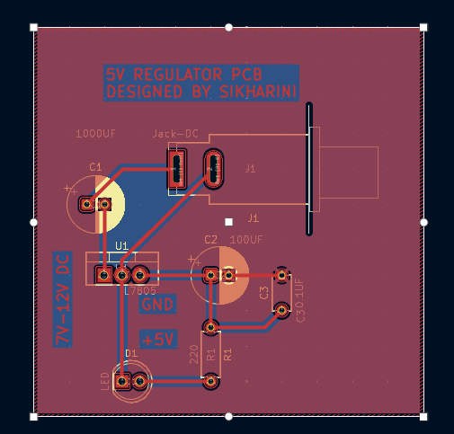

# 5v-REGULATOR-PCB
5V Voltage Regulator PCB designed using KiCad
## Features
-uses L7805 voltage regulator
-converts DC input into stable 5V output
-includes filter capacitors
-LED power indicator
-Compact pcb layout

## SOFTWARE USED
-KiCad

## PCB LAYOUT

## SCHEMATIC DIAGRAM

![SCHEMATIC]?(SCHEMATIC.png)

## 3D VIEW

## DESIGNED BY
SIKHARINI S
